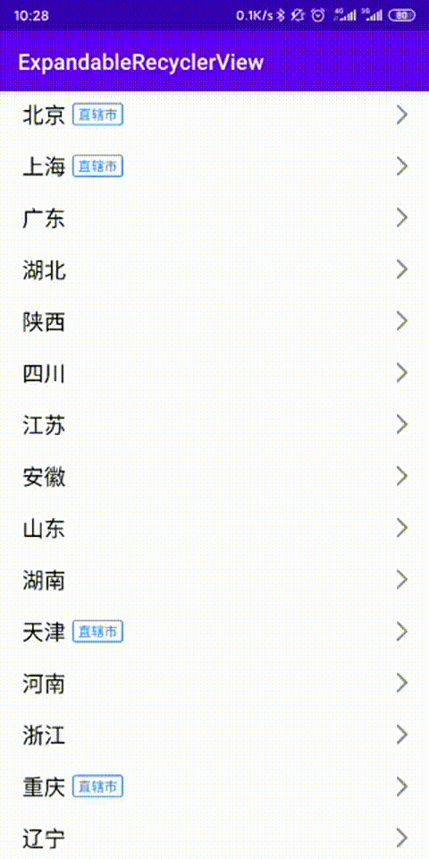
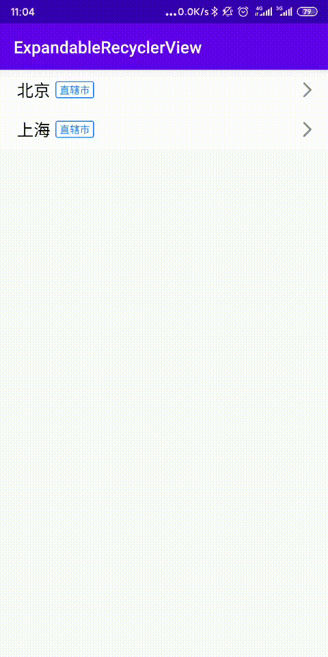
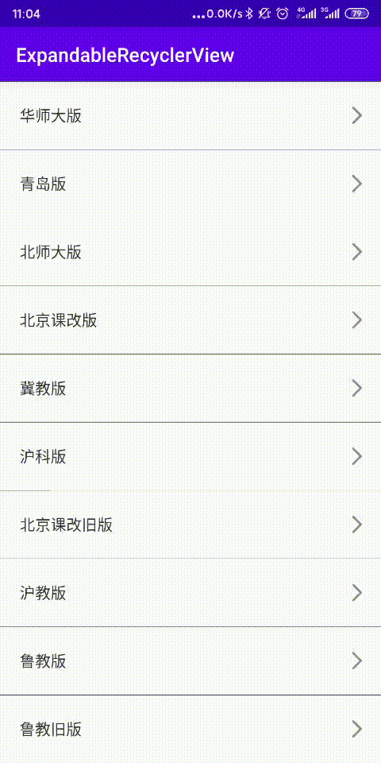

# ExpandableRecyclerView 
[中文README](./README_CN.md)
## Design Sketch

### Stick Header:



### Last item expand:


### GridLayoutManager:


## features:
- Expand and close animations smoothly
- Supports expanding only one Group
- Support to expand and close all
- Supports multiple types of items
- Supports LinearLayoutManager and GridLayoutManager
- Support sticky header
- Expanded state saving and recovery (when switching between portrait and horizontal screens)
- Support for Java project integration (>= v0.6.0)

## Welcome to download the demo and experience the effect
Download Url https://www.pgyer.com/ExpandableRecyclerView


## How to use:
1. include dependence

last_version = 

```gradle
implementation("pokercc.android.ExpandableRecyclerView:expandableRecyclerView:${last_version}")

```

2. Write code
- use ExpandableRecyclerView in you layout xml
- expand ExpandableAdapter,to create your adapter


Attention:
- Using StickyHeaderRecyclerViewContainer，GroupViewHolder.itemView please set an opaque background, otherwise penetration will occur
- ExpandableRecyclerView's height must set to match_parent or static size, Otherwise, the RecyclerView height may change during expansion and closure, causing problems for the execution of the animation


Design: https://dribbble.com/shots/3253927-Accordion